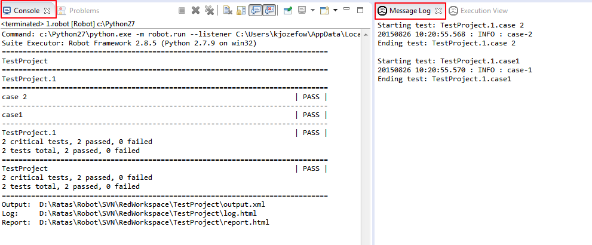

## Create Project, add test,run

In order to start working with RED & Eclipse, you need to set up couple of things first. Robot Perspective Workspace & project Create TestSuite Content assistant Running TestSuite Console and message log Execution status

### Robot Perspective

All RED activities are performed within 2 perspectives: _Robot_ , _Debug_ . Former one is used to construct and execute tests, later one is for debugging test-cases. To start working with RED, you should activate Robot perspective first.

*   Check if you have already set Robot perspective:

    
*   Set perspective to Robot by issuing action: _Window -> Open Perspective -> Other ... -> Robot_

### Workspace & project

**Workspace** stores all global Eclipse & Red preferences, if not set previously (first run or workspace path is non valid) Eclipse will show dialog to set path.
User can always switch workspaces, and if necessary, perform projects import from locations outside of current workspace.
Switching Workspace is done by menu action: _File -> Switch Workspace ..._

**Project** is an equivalent to folder in OS, it stores files and settings relevant to a group of files. In order to work with RED, **Robot Project** has to be created.
Create new Project can be done by:

*   _File->New-> Robot Project_ (item can be found under selection _New -> Project .. -> Robot Framework -> Robot Project_ )
*   Right click menu on Project Explorer with selection as above

If you which to import anything into Workspace ( already existing Project) or into Project (existing testcases), menu _Import ..._ will open up wizard.
Upon creating Project, you should have see similar structure in Project Explorer tree which will also indicate that RobotFramework is visible to Eclipse

### Create TestSuite

To create sample test you should invoke action: _File -> New -> Other ... -> Robot Framework -> Robot Test Suite_. Same action can be accessed by right click menu. RED consists of 2 different modes of editing, a Table (Ride-like style) and Text style.
By default Table editor is used when TestCase file is opened.

Additionally, Source tab shows text representation of TestSuite:

#### Content assistant

Just like other modern Developments Environments, RED supports content assistance/code completion.
When editing tab or item in text editor, press CTRL+SPACE keys to activate hints for Keywords.

### Running TestSuite

To run TestSuite, _Run_ button needs to be selected or right-click menu on file can be issued.

#### Limiting test cases to be run

To limit list of test cases to be run, open _Run Configurations ..._,

in Robot part you can specify which test cases should be run by using either tags or include/exclude list of test cases in active project.

#### Console and message log

During TestSuite execution, RED displays RobotFramework console and message logs.
Those information are available by view Console and Message Log, by default visible in the Robot perspective or by _Window -> Show View -> Other.... -> Robot_

If any of those 2 views are missing, best way is to reset perspective settings by using action _Window -> Reset Perspective ..._

#### Execution status

RED can show execution status of TestCases along with outcome result and execution time.

Execution View is not in default Robot perspective thus it needs to be manually added.
Visit _Window-> Show View -> Robot -> Execution View_