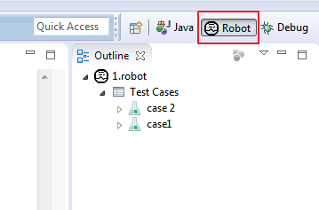
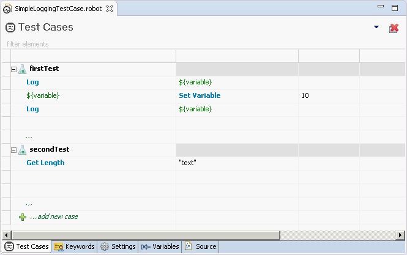
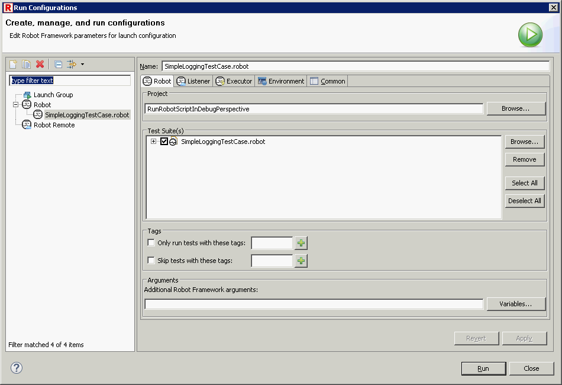

<html>
<head>
<link href="PLUGINS_ROOT/org.robotframework.ide.eclipse.main.plugin.doc.user/help/style.css" rel="stylesheet" type="text/css"/>
</head>
<body>
<a href="../../../help/index.html">RED - Robot Editor User Guide</a> &gt; <a href="../../../help/first_steps/first_steps.html">First steps with RED</a> &gt; 
	<h2>Create project, add test and run</h2>
	
	In order to start working with RED &amp; Eclipse, you should set RED perspective. In this perspective you can add robot project and test suites/resource files.
	You can add python files too with variables or library schema.

<h3>Robot Perspective</h3>

All RED activities are performed within 2 perspectives: <i>Robot</i>, <i>Debug</i>. Former one is used to construct and execute tests, later one is for debugging test-cases.

To start working with RED, you should activate Robot perspective first.

<ul>
<li>Check if you have already set Robot perspective: 
	 </li></ul></body></html>

 
<li>Set perspective to Robot by issuing action: <code><a class="command" href="javascript:executeCommand('org.eclipse.ui.perspectives.showPerspective(org.eclipse.ui.perspectives.showPerspective.perspectiveId=org.eclipse.ui.perspectives.RobotPerspective)')">
Window -&gt; Perspective -&gt; Open Perspective -&gt; Other... -&gt; Robot</a></code></li>

### Workspace &amp; project

__Workspace__ stores all global Eclipse &amp; Red preferences. If it not set previously, Eclipse will show dialog to set path.

User can always switch workspaces, and if necessary, perform projects import from locations outside of current workspace.
Switching Workspace is done by menu action: __`` File -&gt; Switch Workspace ``__

__Project__ is an equivalent to folder in OS, it stores files and settings relevant to a group of files.In order to work with RED, __Robot Project__ has to be created.  
Creating new Project can be done by:

*   __`` File -&gt; New -&gt; Robot Project ``__ (item can be found also under selection __`` New -&gt; Project... -&gt; Robot Framework -&gt; Robot Project ``__)
*   Right click menu on Project Explorer with selection as above

If you wish to import anything into Workspace (i.e. already existing Project) or into Project (existing test cases), menu _Import... _will open up wizard.Upon creating Project, you should have see similar structure in Project Explorer tree, which will also indicate that RobotFramework is visible to Eclipse.

  

If the project doesn't look like above (there is no brown icon or no red.xml file) it means that the Project is different type than Robot.
Fix this by right-click on Project name,from Robot Framework select __Configure as Robot project__

### Create TestSuite

To create sample test you should invoke action: __`` File -&gt; New -&gt; Other... -&gt; Robot Framework -&gt; Robot Test Suite ``__. Same action can be accessed by right click menu.  
Double click on file in Project Explorer will open file's editor.  
RED consists of 2 different modes of editing: a Table (Ride-like style) and Text style. At the bottom of opened editor, there are list of tabs.Rightmost opens text editor(Source),others are for Table syles.   
By default Source editor is used when Test Suite file is opened.  

Source view displays text representation of all table views:

#### Content assistant

Just like other modern Developments Environments, RED supports content assistance/code completion. 

When editing tab or item in text editor, press CTRL+SPACE keys to activate hints for robot keywords an variables.

### Running TestSuite

To run TestSuite, _Run_ button needs to be selected or right-click menu on file in Source view. The same action is in right-click menu on file in Project Explorer.

#### Limiting test cases to be run 

To limit list of test cases to be run, open _Run Configurations..._,   

In Robot part you can specify which test cases should be run by using either tags or include/exclude list of test cases in active project. 

To run single test case in test suite, you can select desire test case in Project Explorer and in right-click menu select "Run".

#### Console and message log

During TestSuite execution, RED displays RobotFramework console and message logs.

Those information are available in Console and Message Log, by default visible in the Robot perspective or by __`` Window -&gt; Show View -&gt; Other... -&gt; Robot ``__
 
 
If any of those 2 views are missing, best way is to reset perspective settings by using action <code><a class="command" href="javascript:executeCommand('org.eclipse.ui.window.resetPerspective()')">
Window -&gt; Perspective -&gt; Reset Perspective...</a></code>

#### Execution status

RED can show execution status of TestCases along with outcome result and execution time. This view is in Robot perspective by default.
 
  

To open Execution go to: __`` Window -&gt; Show View -&gt; Robot -&gt; Execution View ``__