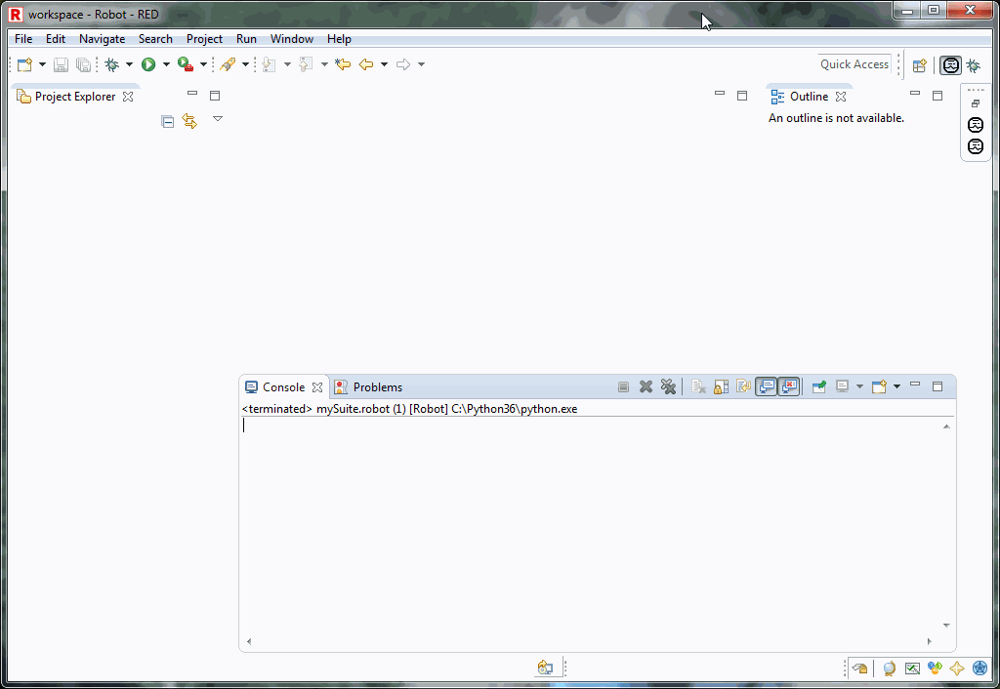

## RED Robot Editor User Guide

### Contents

  * [About this Guide](/about.md)
  * [Legal](/legal.md)
  * [RED key shortcuts cheatsheet](/keys.md)
  * [First steps with RED](/first_steps/first_steps.md)
    * [Download and install](/first_steps/download_install.md)
    * [Eclipse principles](/first_steps/eclipse_principles.md)
    * [Setting up environment](/first_steps/setting_up_environment.md)
    * [Create project, add test and run](/first_steps/create_run.md)
    * [Preferences and red.xml](/first_steps/preferences_misc.md)
  * [User guide](/user_guide/user_guide.md)
    * [Quick start with RED - Robot Editor](/user_guide/quick_start.md)
    * [General usage hints](/user_guide/general.md)
    * [Working with RED](/user_guide/working_with_RED.md)
      * [Table Editors - general usage hints](/user_guide/working_with_RED/table_general.md)
      * [Recognizing external libraries in RED](/user_guide/working_with_RED/libs.md)
      * [Variable mapping - dealing with parametrized paths to libraries and resources](/user_guide/working_with_RED/variable_mapping.md)
      * [Variable Files - using files with variable accessible anywhere inside Project](/user_guide/working_with_RED/variable_files.md)
      * [Custom python/class paths and path relativeness](/user_guide/working_with_RED/custom_paths_relatve.md)
      * [Importing files and projects to workspace](/user_guide/working_with_RED/importing.md)
      * [Remote library](/user_guide/working_with_RED/remote_library.md)
      * [Red.xml description](/user_guide/working_with_RED/red_xml.md)
      * [Content assistance](/user_guide/working_with_RED/content_assist.md)
      * [Dark theme in RED](/user_guide/working_with_RED/dark_theme.md)
    * [Validation](/user_guide/validation.md)
      * [Limiting validation scope](/user_guide/validation/scope.md)
      * [Configuring problems severity](/user_guide/validation/validation_preferences.md)
      * [Running validation in command line](/user_guide/validation/headless.md)
      * [Tasks/TODO](/user_guide/validation/tasks.md)
    * [Launching Tests](/user_guide/launching.md)
      * [User interface](/user_guide/launching/ui_elements.md)
      * [Local launches](/user_guide/launching/local_launch.md)
      * [Local launches scripting](/user_guide/launching/local_launch_scripting.md)
      * [Remote launches](/user_guide/launching/remote_launch.md)
      * [Controlling execution](/user_guide/launching/exec_control.md)
      * [Debugging Robot](/user_guide/launching/debug.md)
        * [User interface](/user_guide/launching/debug/ui_elements.md)
        * [Breakpoints](/user_guide/launching/debug/breakpoints.md)
        * [Hitting a breakpoint](/user_guide/launching/debug/hitting_a_breakpoint.md)
        * [Debugger preferences](/user_guide/launching/debug/preferences.md)
        * [Debugging Robot & Python with RED & PyDev](/user_guide/launching/debug/robot_python_debug.md)
      * [Launching preferences](/user_guide/launching/launch_prefs.md)
      * [RED Tests Runner Agent](/user_guide/launching/red_agent.md)
    * [Integration with other tools](/user_guide/tools_integration.md)
      * [Mounting folders via SSH](/user_guide/tools_integration/virtual_folders.md)
      * [PyDev and PyLint](/user_guide/tools_integration/red_pylint.md)
      * [Robot Framework Maven plugin](/user_guide/tools_integration/maven.md)
      * [Running tests using Gradle](/user_guide/tools_integration/gradle.md)
      * [Robot Framework Lint](/user_guide/tools_integration/rflint.md)
    * [Known issues and problems](/user_guide/known_issues.md)

### About

RED is modern editor based on Eclipse IDE to allow quick and comfortable work
with Robot testware.

### What RED provides:

  * text editor with validation and code coloring
  * table editors like in Ride fully synced with source
  * debug&remote debug with breakpoints, testcase stepping (step into, step over), runtime variable lookup & modification
  * code assistance & completion for variables, keywords, testcases, resources and libraries
  * real time testcase validation
  * execution view
  * support for plugins via Eclipse mechanisms
  * support for Robot formats: .txt, .robot, .tsv (HTML format is not supported)

### Look & feel

