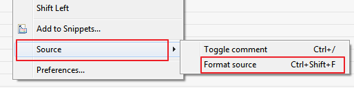

[RED - Robot Editor User Guide](http://nokia.github.io/RED/help/index.md) >
[User guide](http://nokia.github.io/RED/help/user_guide/user_guide.md) >

## General usage hints

### Tab key behavior

Tab key press behavior can be changed at `[ Window -> Preferences -> Robot
Framework ->
Editor](javascript:executeCommand\('org.eclipse.ui.window.preferences\(preferencePageId=org.robotframework.ide.eclipse.main.plugin.preferences.editor\)'\))`
in **Source** section.  
It is set by default to be aware of the file type. For .tsv files each Tab
will produce item separator, for text files 4 spaces will generated.  
Moreover, **jump out of active region** behavior can be enabled there. If
enabled, instead of inserting defined separator in source editor, RED will
move cursor to the end of active region. It may be useful for example for
variables edition.  
  
  
  

### Validating & revalidating whole project/workspace

Validation of test case is triggered by any user actions, it is also done
during files & project imports.  
Whenever there is a change in multiple files (for instance find/replace) or
big file import/deletion, it is good to force revalidation of project.  
It is done accessing option **`Project -> Clean...`**  
  
  
  
At the bottom right of RED, progress bar will appear with the status of
validation.  

### Automatic source formatting CTRL+SHIFT+F

Formatting source is Eclipse based mechanism which provides code formatting
with arbitrary ruleset.  
For now, **code formatting in RED is meant to be proof of functionality, it is
not configurable.**  
In near future we will provide a way to include custom rule sets for code
formatting and check style.  
It is invoked by right click menu in Source editor.  
  
  
  
  

### Quick Fix - Ctrl+1

Quick Fix is an Eclipse mechanism to provide user with predefined action for
solving issues. If the Quick Fix action is available, light bulb icon is shown
next to line number.  
  
  
  
Quick Fix can be accessed by clicking on underlined item and choosing from
right click menu Quick Fix or directly by Ctrl+1.

#### Running selected test case

RED can run or debug one, selected testcase. This can be achieved by altering
Run Configuration :  
  
  
  
and also by placing cursor on testcase body and using right click menu:  
  
  
  

