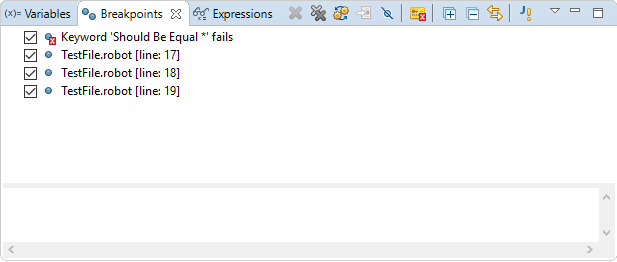

## Breakpoints

List of all breakpoints is displayed in **Breakpoints** view of Debug
perspective. This view can be used to view and edit breakpoints even without
any debugging session currently launched.

Using this view:

  * each breakpoint can be enabled/disabled, 
  * each breakpoint can be removed, 
  * for each Robot breakpoint the attribute can be set: 
    * **Hit count** : breakpoint will cause execution suspension only when instruction in the breakpoint line will be executed for the `N`-th time in session. Useful to activate breakpoint inside a loop statement on certain iteration 
    * **Conditional** : breakpoint will cause execution suspension only when condition is satisfied. The condition should be a call to RF keyword written in RF syntax and it is considered satisfied if the ended with **PASS** status unsatisfied otherwise; for instance (remember about separators): 

Should be Equal    ${variable}    10

is satisfied only if value of `${variable}` is equal to `10` at the moment
when execution hits the line in which such breakpoint is placed.

  * double click on breakpoint to open the file in which selected breakpoint is placed 

  

Note

    When breakpoint is edited the changes has to be saved. Unsaved changes in breakpoint are marked with ***** mark placed in Breakpoints view title similarly as in editors. Breakpoints are stored in workspace metadata so they are not removed when RED/eclipse is restarted. 

[Return to Help index](http://nokia.github.io/RED/help/)
