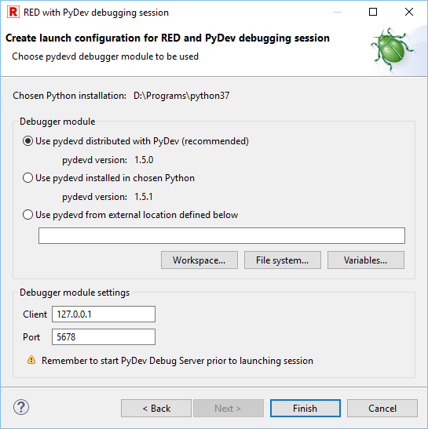
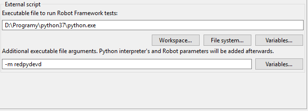
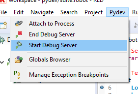
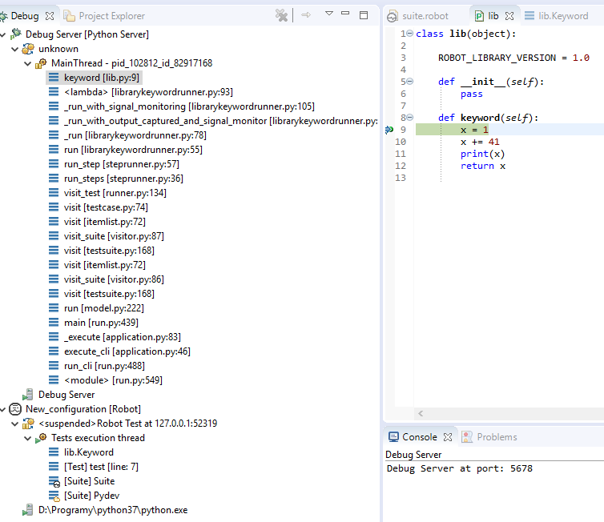

[RED - Robot Editor User Guide](http://nokia.github.io/RED/help/index.md) >
[User guide](http://nokia.github.io/RED/help/user_guide/user_guide.md) >
[Launching Tests](http://nokia.github.io/RED/help/user_guide/launching.md) >
[Debugging
Robot](http://nokia.github.io/RED/help/user_guide/launching/debug.md) >

## Debugging Robot & Python with RED & PyDev

It is possible to setup debugging sessions on both Robot and Python code
levels using RED together with PyDev in single RED/Eclipse instance.

### Prerequisites

  * Any Eclipse-based installation with both RED and PyDev installed, 
  * the `pydevd` debugger module - this is provided by PyDev or manually, can be also installed into Python with `pip`, 
  * the `redpydevd` runner script - this is provided by RED or manually. 

In order to setup debugging sessions proper launch configuration needs to be
created. In order to do this one can simply run a wizard: `[ New -> Other ->
Robot Framework -> RED with PyDev debugging
session](javascript:executeCommand\('org.eclipse.ui.newWizard\(newWizardId=org.robotframework.red.wizard.new.redPydevdLaunchConfig\)'\))`.
The launch configuration created by this wizard will be created for selected
suites inside project (if there is a suite selected in Project Explorer view).

### Wizard

#### Choosing Python interpreter

First page of wizard allows to choose any environment from those defined in
Preferences. It will be used to execute the `redpydevd` runner script and
effectively the chosen Robot suites.

  
  

#### Choosing redpydevd module

Second page allows to choose which `redpydevd` script should be used. There
are 3 possibilities:

  * The one installed in chosen Python interpreter - if there is no `redpydevd` installed or is outdated (in different version than currently supported) then RED will use `sdist` and `pip` to install that module (offline), 

  * the one exported to chosen location in your system - the script file will be written in this location and used by created launch configuration, 

  * the one already existing in chosen location. 

  

Note

    The version of `redpydevd` module expected by RED is displayed at this wizard page. Make sure to use the same version if you're using already existing script exported to local location some time ago. 

#### Choosing pydevd module

Last page allows to choose which `pydevd` module should be used. There are 3
possibilities:

  * The one distributed with PyDev - this option is recommended because it ensures that the version of module is the same as PyDev would expect; this option may be disabled if the module couldn't be located in your PyDev installation, 

  * the one installed in chosen Python interpreter - this option is disabled if `pydevd` is not installed. You need to manually install it using `pip` to enable it. Not that the version may be different than the one provided by PyDev as visible on screen above, 

  * the one already existing in chosen location - if you happen to download `pydevd` from elsewhere. 

It is also possible to set the address and port on which PyDev will
communicate with the module.

#### Created launch configuration

After clicking **Finish** RED will install or export `redpydevd` runner (if
neeeded) and create new launch configuration with prefilled **External
script** settings at **Executor** tab. For example:

### Debugging

In order to be able to debug: the project and suite(s) needs to be defined at
**Robot** tab of launch configuration. It may be already defined if suite was
selected in Project Explorer view when starting wizard. Next one need to:

  * Put a breakpoint either in selected suite code (.robot file) or in Python code. Note that PyDev requires **Debug** perspective to be first activated (see: [PyDev Remote Debugger User Guide](http://www.pydev.org/manual_adv_remote_debugger.md)). 

  * the **Python debug server** needs to be started. This can be done manually:  
  
or automatically if proper PyDev preference is enabled (`Preferences -> PyDev
-> Debug -> Remote debugger server activation`).

  * the address and port passed by launch configuration for Python debugger need to be the same as PyDev is using (only needed if changed to non-default), 

  * launch created configuration in debug mode. 

After launching one should see Robot debugger stopping at breakpoint:

In this example the keyword **`keyword`** comes from tiny local library. Once
**Step Into (F5)** is executed the editor should open:

This dummy _editor_ explains that RED debugger cannot go into library keywords
code on it's own but PyDev can be used cooperate and be able to debug Python-
level code. One can use **Click here** and RED should open Python script where
keyword is defined:

Put a breakpoint there and resume Robot code execution. Now PyDev debugger
should pause allowing to debug Python code (note there are two sessions in
**Debug** view - one of PyDev operating on Python code and second of RED
operating on RF code):

