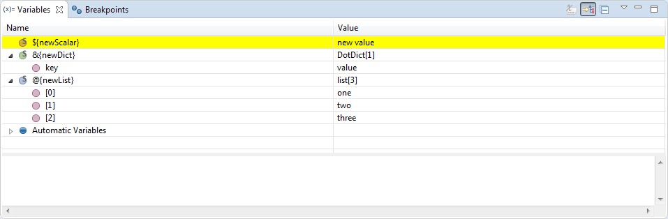
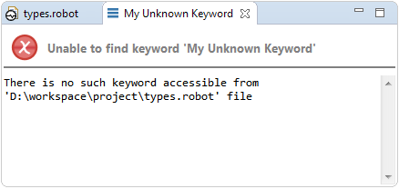

## Suspended execution

Whenever debugger suspends the execution there are many useful informations
presented to user as well as new opportunities to influence the running tests
appear. First of all the toolbar buttons gets activated:

moving from left to right:

  * **Skip All Breakpoints** \- allow to continue execution onwards without stopping on defined breakpoints (globally disabling all the breakpoints) 
  * **Resume** \- ` F8` described in [Controlling execution](../exec_control.md)
  * **Suspend** \- as above
  * **Terminate** \- ` Ctrl`+`F2` as above
  * **Disconnect** \- as above
  * **Step Into** \- ` F5` \- each `F5` key press will execute active line and move to next one. If active line consists Keyword or embedded TestCase, test executor will jump into item and execute it line by line. To exit from executing inherited items use Step Return (`F7`)
  * **Step Over** \- ` F6` \- each `F6` key press will execute active line and move to next one. If keyword exists in current line, keyword result will be returned without going into Keyword content
  * **Step Return** \- ` F7` \- allows to return to main TestCase execution from embedded TestCase or Keyword if Step Into was used before

### Debug view

When execution is suspended the **Debug** view shows all the frames on current
path in execution tree. Bottom part of this path directly corresponds to the
tree which can be seen in **Execution** view as depicted below:

The bottom frame corresponds to `Project` suite (this is a directory in file
system, so there is a little directory decoration visible). Next frame
corresponds to `Calculations` suite (which is a `calculations.robot` file) and
the frame above it represents `Divisions` test inside that suite. Next frames
do not correspond to any node inside the execution tree visible in
**Execution** view. It can be read that stopped execution is currently inside
`Divisions` test at instruction in line `35`, which called a keyword `Divide`
which then called another keyword `BinaryDivision` from line `57` which
finally called library keyword `Evaluate` coming from `BuiltIn` library at
line `61`.

Additionally you may see that there is a single execution thread (RF executes
tests in single thread); the execution is suspended and agent is communicating
with RED using localhost at port `59344`.

### Variables view

Whenever you select some frame inside **Debug** view the Robot variables
defined inside it are shown in **Variables** view. This view handles scalar,
list and dictionary variables. The scalar variable only shows its value while
the other two types are showing also the their contents inside it. Depending
on the type of variable the icon have different color assigned as visible on
image below:

As you can see some of the variables are displayed under **Automatic
Variables** node. This is a place where all the variables which are built-in
into the Robot are gathered together (refer to [ RF User
Guide](http://robotframework.org/robotframework/latest/RobotFrameworkUserGuide.html
#built-in-variables)). All the user variables are displayed on top-level.

Variable scope (see [ User
Guide](http://robotframework.org/robotframework/latest/RobotFrameworkUserGuide.html
#variable-scopes) on this topic) is reflected in this view using icon
decoration: **G** , **S** , **T** or **L** is placed on variable icon for
**Global** , **Suite** , **Test** , **Local** scopes. You may find out that
global-scoped variables are visible for every single stack frame, suite-scoped
variables are only visible in a suite frame and frames below, test-scoped
variables only in test frame and below while local-scoped variables only in
current frame. Of course for example `${SUITE_NAME}` automatic variable (which
has suite scope) may be visible for all suite frames, however it may have
different values as the suites are nested.

For both dictionaries and lists the actual type of the python object is
written in **Value** column. On the picture above **DotDict[3]** for
`&{dictionary}` variable mean that in python this object has type **DotDict**
, the rest mean that there are `3` elements inside it. Lists are labeled in
the same way. Additionally you may display **Actual Type** column which would
also show types of objects for scalar variables and for objects inside
list/dictionaries. To do it click on arrow icon in the top right corner of the
Variables view, choose **Layout** - > **Select Columns...** and select
**Actual Type** column.

Variables view also allows to [edit values](variables.md) of displayed
variables.

Variables are send from tests to RED every time when RED ordered to suspend
the execution. Sometimes you may observe that variables are highlighted with
yellow color:

This mean that variable `${scalar}` either changed the value comparing to
previous time when variables were send to RED or it didn't existed previously.
Same highlighting will be used if you manually change the value.

### Editor

After suspension you may open source file related to any frame by double
clicking on it. By default editor for top frame is opened. Of course some
frames may not have related source (for example frame representing a suite
made from directory). Remember that RED debugger only supports debugging Robot
code so you will not be able to debug python code for library keywords (you
may however setup a session in which [both RF & python code is
debugged](robot_python_debug.md)). Frames created for library keywords have
special kind of editor which allows to find the source code for this keyword.

#### Instruction pointers

The editor opened for any frame displays **instruction pointer** \- by default
it's a green background displayed in line which relates to chosen stack frame.
You may also notice that instruction pointer for top frame is a bit darker
than pointers for other frames. The way the instruction pointers are displayed
can be configured in preferences: [ General -> Editors > Text Editors >
Annotations](javascript:executeCommand\('org.eclipse.ui.window.preferences\(preferencePageId=org.eclipse.ui.editors.preferencePages.Annotations\)'\))
(change annotations **Debug Call Stack** for ordinary frame or **Debug Current
Instruction Pointer** for top frame)

You may also encounter situation in which current frame is somehow erroneous.
This situation is rather unusual in local launches (although may happen) but
it can be more common in remote debugging sessions. There may be many
different causes for such debugging errors but in general it happens when
remote code under execution differs from the code found locally in RED
workspace. For example picture below presents situation in which remotely
executing `types.robot` suite calls `Log` keyword, but in local code there is
a call to `Log many` keyword. As you can see instruction pointer in this
situation is RED and there is a problem explanation when you hover the cursor
over the problematic line.

Similarly as with usual instruction pointer the outlook of erroneous
annotations can be also changed in preferences (look for **Red Erroneous Debug
Call Stack** and **Red Erroneous Debug Current Instruction Pointer** ).

#### Showing variables

The editor shows current values of variables when hovering mouse cursor over
any variable name. This is depicted on image above, where `${scalar}` variable
is shown to have current value of `100`.

#### Assistance editor

Library keyword frames do not display the code, but instead special kind of
**debugger assistance** editor is used. For example if you **Step Into** the
library keyword you will see following editor opened:

One may change [Debugger preferences](preferences.md) in order to never
suspend inside the library keyword this way.

Additionally assistance editor may also describe erroneous debugger states if
there is no source in which instruction pointer can be shown. You may found
yourself in this situation even in local launches when your test call some
unknown keyword:

### Continuing

Whenever you're ready to resume tests execution simply hit **Resume** button
(or ` F8`) and debugger will suspend on next breakpoint or in next erroneous
state (if not disabled in preferences) or whenever you explicitly pause the
execution. Apart from that you may perform step. There are 3 kinds of steps:

  * **Step Into** ` F5` \- this kind of step is only possible for top stack frame. When performing **step into** the execution will resume only for a single step which will enter inside into the keyword from current line. 

  * **Step Over** ` F6` \- this kind of step is possible for every frame on stack and it will behave differently for each of them. In general this kind of step means 'suspend the execution on next keyword from instruction pointed by selected stack frame on the same level'. 

  * **Step Return** ` F7` \- similarly to **Step Over** this action is possible for every frame on stack and will have different behaviour. This kind of step means 'suspend the execution on next keyword which will be executed after selected frame have ended'. For frame related to user keyword this mean that debugger will pause on next instruction after this user keyword ends. For test-related frame the dubugger will suspend at the very first instruction in next test (if any). For suite-related frame the debugger will suspend at very first keyword in next suite (if any). 

Of course the debugger will suspend if it encounter e.g. breakpoint inside the
code which should be stepped over.

  
  

[Return to Help index](http://nokia.github.io/RED/help/)
