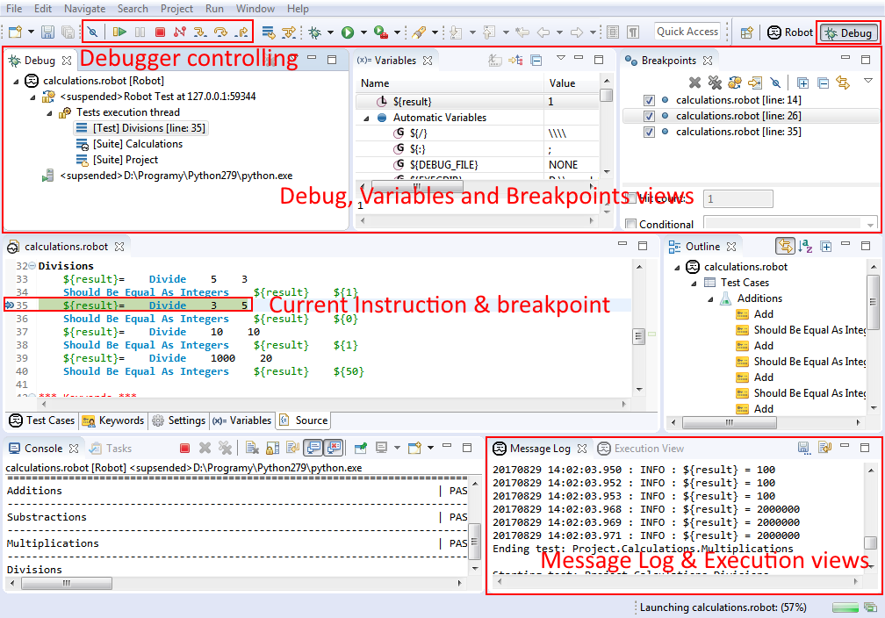

## User interface

Debug perspective looks as follows:

Major parts of this perspective are:

  * **Controller toolbar** from which user can perform [stepping](suspended_execution.md) as well as resuming, suspending, terminating and disconnecting from running tests (see [Controlling execution](../exec_control.md)). It is also possible to deactivate all the breakpoints globally using **Skip All Breakpoints** button. 
  * **Execution** and **Message Log** views described [here](../ui_elements.md). 
  * **Debug** view where currently launched session is visible. When [suspended](suspended_execution.md) there is a stack presented showing current path to root in suites execution tree. 
  * **Variables** view presenting variables bounded with selected stack frame from Debug view. It is also possible to edit values of those variables (see [Changing variables](variables.md)). 
  * **Breakpoints** view gathering all the breakpoints defined in users workspace. It allows to edit as well as enable/disable the breakpoints - see [Breakpoints](breakpoints.md). 
  * **editor area** ; when execution suspends and user opens stack frames in **Debug** view the source code related to selected frame is shown in editor. There is a current line highlighted and also other execution related information (see [Suspended execution](suspended_execution.md)). 

  

[Return to Help index](http://nokia.github.io/RED/help/)
