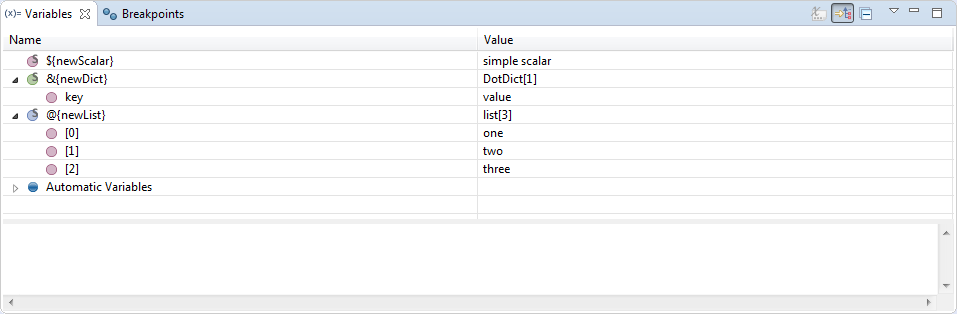

## Changing variables

Apart from displaying variables it is possible to change their values when
execution gets suspended. This can be done through **Variables** view in 3
possible ways:

  * by editing the cell with value in **Value** column, 
  * by choosing **Change Value...** from context menu of selected variable, 
  * inside the panel at the bottom of **Variables** view. 

#### Variable types

Scalar variables are assigned with provided value. In case of lists or
dictionaries just use usual RobotFramework separators in order to provide
whole new list/dictionary. For example writing:

1    2    3    4

for list-variable will create a new list consisting 4 elements while writing:

a=1    b=2    c=3

for dictionary-variable will create a new dictionary consisting 3 key-value
pairs. Alternatively list or dictionary elements may be provided in comma-
separated syntax using brackets:

[1,2,3,4]

and:

{a=1,b=2,c=3}

for lists and dictionaries respectively.

Note

    Beside changing values of top-level variables it is also possible to change the values inside the lists or dictionaries just the way it is described above. 

If the value changes successfully the whole variable will be highlighted with
yellow color, otherwise you will be presented with error message in case of
problems.

#### Variable scopes

The variable scope is taken into account when changing the value. This means
that if you're changing the value of a variable visible in **global** scope
the change will be visible in all the stack frames. Same rule holds for all
scopes - changing **local** variable will change the value inside current
frame, changing **test** variable will change it's value in all the frames up
to test frame and similarly for **suite** variables (up to lowest suite
frame).

  

[Return to Help index](http://nokia.github.io/RED/help/)
