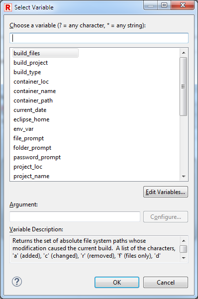

## String substitution variables

Eclipse string substitution feature allows using of default or custom
variables during command line creation, when such variables are resolved and
replace with string values. Default Eclipse variables and user defined ones
can be chosen from variables selection dialog:

RED accepts Eclipse string substitution variables in following locations:

  * Launch configuration dialog Robot tab for setting additional Robot Framework arguments,
  * Launch configuration dialog Executor tab for setting additional interpreter or additional executable file arguments, as well as executable file path,
  * RfLint validation preference page for setting additional arguments,
  * Default launch configuration preference page.

When tests are run or RfLint validation is started RED replaces all known
variables in command line with actual string values.

Eclipse string substitution variables can be created and configured at
[Window->Preferences->Run/Debug>String
Substitution](javascript:executeCommand\("org.eclipse.ui.window.preferences\(preferencePageId=org.eclipse.debug.ui.StringVariablePreferencePage\)"\))
preference page.

[Return to Help index](http://nokia.github.io/RED/help/)
