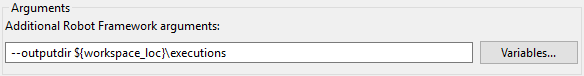

## Parameterizing launches

Eclipse string substitution feature allows using built-in or custom variables
in different places - for example in launch configurations where they are
resolved and replaced with their values prior to launch.

### Using variables

In the example above built-in `${workspace_loc}` variable is used to change
the output directory where Robot will put log or report files.

In places where using variables is possible there is additional button which
opens variables selection dialog:

RED accepts string substitution variables in following locations:

  * **Launch configuration** dialog: **Robot** tab - for setting additional Robot Framework arguments, 
  * **Launch configuration** dialog: **Executor** tab - for setting additional interpreter or additional executable file arguments as well as executable file path,
  * **RfLint validation** preference page - for setting additional arguments,
  * **Default launch configuration** preference page - in fields corresponding to those in **Launch configuration dialog**.

When tests are run or RfLint validation is started RED replaces all known
variables in command line with actual string values.

### Creating custom variables

Custom string substitution variables can be created and configured at [
Window->Preferences->Run/Debug->String
Substitution](javascript:executeCommand\("org.eclipse.ui.window.preferences\(preferencePageId=org.eclipse.debug.ui.StringVariablePreferencePage\)"\))
preference page.

### Overriding custom variables in variables sets

Once variables are used in launch configurations it would be sometimes useful
to be able to switch between different values. For example the launch
configuration may add `--variablefile path/to/file${env_no}.py` so that it
would be possible to execute tests with e.g. `file1.py` or `file7.py`. Of
course value of custom variable can be freely changed at **String
Substitution** preference page but this could be tedious task when executing
tests against multiple variable files.

In order to be able to quickly change between different values the RED Active
string substitution sets feature can be used.

### Defining different variables sets

The variables sets can be configured at [ Window->Preferences->Robot
Framework->Launching->Active String Substitution
sets](javascript:executeCommand\("org.eclipse.ui.window.preferences\(preferencePageId=org.robotframework.ide.eclipse.main.plugin.preferences.launch.activeVarsSets\)"\))
preference page:

Each set defined here provides possibility to differently override values of
custom string variables and there can be multiple sets defined. In the example
above the `${env_no}` is differently overridden in two sets while `${var}` is
not overridden and default value will be always used (the empty string in this
case).

### Changing active variables set

At given point in time at most one set can be made _active_. RED would use
values from this set when resolving those variables prior to launch. Active
set can be chosen either at the preference page (using context menu option) or
from main toolbar in application thus providing quick shortcut to switch
between different sets of values as depicted below:

  
  

[Return to Help index](http://nokia.github.io/RED/help/)
