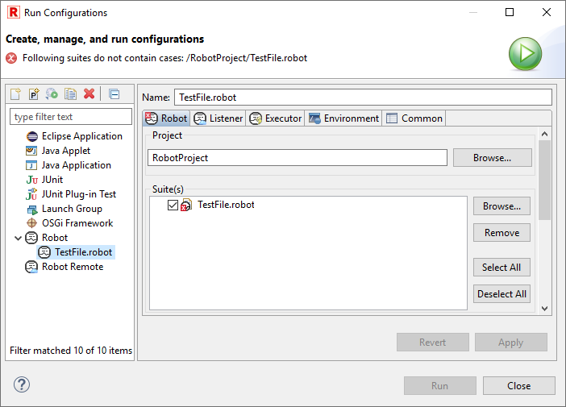
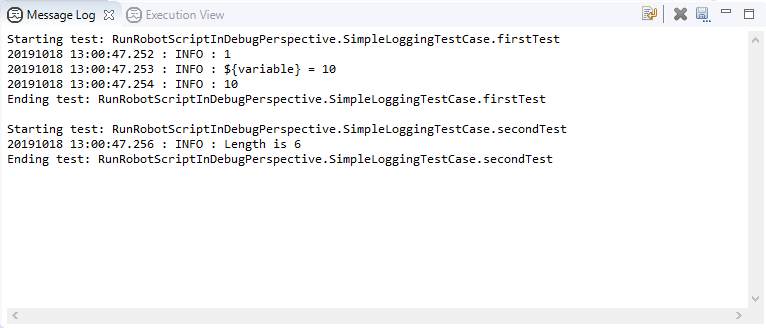

## Launching related UI elements

RED provides couple of elements which are used in order to launch test and
communicate with them when they are running.

### Launching tests

Launch configuration has to be created to launch Robot tests. This can be done
either manually or automatically e.g. when launching tests from **Project
Explorer** or from **Suite Editor**.

  * **Launch Configuration dialog** \- open launch configurations dialog (via [ Run -> Run Configurations...](javascript:executeCommand\('org.eclipse.debug.ui.commands.OpenRunConfigurations'\)) or [ Run -> Debug Configurations...](javascript:executeCommand\('org.eclipse.debug.ui.commands.OpenDebugConfigurations'\)) menu) and create new configuration under _Robot_ or _Robot Remote_ element. For detailed description of both configurations and their possible attributes read [Local launches](local_launch.md) or [Remote launches](remote_launch.md) topic. After creating the configuration it can be launched manually by clicking **Run** / **Debug** button. 

  * **From launching history** \- launch already existing and previously launched configuration. This is possible either from top level **Run** menu or from launching toolbar as depicted on images below: 

 

  * **Whole suites from Project Explorer** \- launch tests for given suite(s). It can be either whole folder containing other suites or simple a suite file. RED will try to find already existing configuration basing on selected items and launch it or it will create new default one for given this selection and then launch it. 

  * **Selected tests from Project Explorer** \- similarly as above configuration for only selected tests inside some suite can be launched by clicking on tests inside particular suite file. 

  * **Selected tests from Suite Editor** \- selected tests can also be launched straight from Suite Editor either in Test Cases page or in Source page. Use context menu or designated keyboard shortcut to perform launch. 

 

### Console view

Console view is standard view provided by eclipse platform. RED is using in to
display output of the tests launch. In case of locally launched tests it
displays standard output and standard error ( _stdout_ and _stderr_ ) of
process which runs the test. It also contains a header in which command line
call and Robot version is shown. Remotely launched tests do not send those
streams to RED, so in this case only messages about remote server status are
displayed.

Note

    You may notice that some links are clickable in output of tests - for example locations of Output/Log/Report files as well as location of argument file (if in use). You can use them to open the files right inside RED.

### Execution view

Execution view is a view provided by RED in which RED is presenting suites
tree together with status of tests/suites (PASS or FAIL). The view is updated
during tests launch thus presenting current execution progress. Remotely
launched tests may also use this view - the only requirement is that the tests
itself has to take [agent](red_agent.md) into execution as a listener.

There are couple of actions possible within this view:

  * **Expand All** \- expands whole tree,
  * **Collapse All** \- collapses the tree,
  * **Show failures only** \- filters the tree, so that only failed elements are presented,
  * **Rerun Tests** \- launches the configuration again,
  * **Rerun Failed Tests Only** \- launches the configuration with tests which failed.
  * **Go To File** \- from context menu on test (also by double click) - opens editor and selects test case.

### Message Log view

Message Log view is a view provided by RED which presents messages logged
during tests execution. Like execution view it it is also updated during tests
launch. Similarly it may also work with Remote configurations when
[agent](red_agent.md) is taken into execution as a listener.

### Debug perspective

RED uses standard eclipse **Debug** perspective when configuration is launched
in debug mode. For more infromation about working with this perspective please
take a look at [Debugging Robot](debug.md) topic.

[Return to Help index](http://nokia.github.io/RED/help/)
