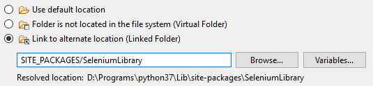

<html>
<head>
<link href="PLUGINS_ROOT/org.robotframework.ide.eclipse.main.plugin.doc.user/help/style.css" rel="stylesheet" type="text/css"/>
</head>
<body>
<a href="RED/../../../../help/index.html">RED - Robot Editor User Guide</a> &gt; <a href="RED/../../../../help/user_guide/user_guide.html">User guide</a> &gt; <a href="RED/../../../../help/user_guide/project_config.html">Project configuration</a> &gt; 

<h2>Dealing with libraries absolute paths</h2>

When library is added to red.xml RED will check if it is located in workspace or not. Depending on the 
    outcome it will be written with workspace-relative path or absolute one. The problem with the latter is that 
    it is not portable between different users and/or systems. This commonly happens for libraries installed into
    <code>site-packages</code> using <b>pip</b>:
    

<h3>Solution</h3>

Solution to this problem is to combine <b>resources linking</b> and <b>path variables</b> so that the path
    in <code>red.xml</code> will use relative path to linked location. In such setup there would be no absolute paths used by 
    <code>red.xml</code> thus making it easier to be shared across different users. In order to achieve that:
    

<ol>
<li>
Open <code><a class="command" href="javascript:executeCommand('org.eclipse.ui.window.preferences(preferencePageId=org.eclipse.ui.preferencePages.LinkedResources)')">
        General -> Workspace -> Linked Resources</a></code> preference page,
        
</li>
<li>
create new variable and make it point to e.g. <code>site-packages</code>:
        

</li>
<li>
choose <code>New -> Folder</code> from context menu in chosen location somewhere inside your project,
        
</li>
<li>
expand <code>Advanced &gt;&gt;</code> button and choose <code>Linked Folder</code>, 
        
</li>
<li>
use <code>SITE_PACKAGES</code> variable and append location of <code>SeleniumLibrary</code> directory,
        

</li>
<li>
now the link will be created resulting in link entry in <code>.project</code> file (no directory is 
        created in the project) and the directory should be visible in Project Explorer,
        

</li>
<li>
finally the entry in <code>red.xml</code> can be changed (this has to be done manually) to use workspace
        relative path to the linked file:
        

</li>
</ol>

The steps above make the project portable between different machines - there is only relative path inside 
    <code>red.xml</code> plus parameterized entry inside <code>.project</code> file. The only thing that needs to be done
    is to define <code>SITE_PACKAGES</code> variable accordingly for different project users.
    

 
</body>
</html>