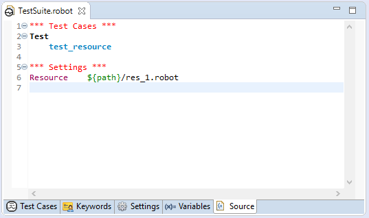

<html>
<head>
<link href="PLUGINS_ROOT/org.robotframework.ide.eclipse.main.plugin.doc.user/help/style.css" rel="stylesheet" type="text/css"/>
</head>
<body>
<a href="RED/../../../../help/index.html">RED - Robot Editor User Guide</a> &gt; <a href="RED/../../../../help/user_guide/user_guide.html">User guide</a> &gt; <a href="RED/../../../../help/user_guide/project_config.html">Project configuration</a> &gt; 

<h2>Variable mappings</h2>

Whenever parameterized import is used in suite/resource file:
	

<pre>
	<code>
    *** Settings ***
    Library      ${libs_dir}/library.py
    Resource     ${res_dir}/resource.robot
    Variables    ${vars_dir}/variables.py
	</code>
	</pre>

RED is not able to evaluate parameters value by itself (since those parameters are resolved during Robot 
	runtime when the value is known):
	

  

<b>Variables mappings</b> is a way to deal with such situation by statically assigning values to parameters so
    that RED can use those values in order to resolve parameterized imports.
    
    <dl class="note">
<dt>Note</dt>
<dd>Variables provided in red.xml are used only by RED for validation purpose and are not added to 
	    Robot run command line when launching execution. During test execution variables have to be provided by Robot.
	    </dd>
</dl>

To resolve parameterized imports open <code>red.xml -> Variables</code> and assign static value for desired
	parameter in Variable mappings section:
	

  

When successful the imports should be be recognized and validation will take place:
	

  

</body>
</html>