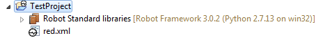

<html>
<head>
<link href="PLUGINS_ROOT/org.robotframework.ide.eclipse.main.plugin.doc.user/help/style.css" rel="stylesheet" type="text/css"/>
</head>
<body>
<a href="RED/../../../help/index.html">RED - Robot Editor User Guide</a> &gt; <a href="RED/../../../help/user_guide/user_guide.html">User guide</a> &gt; 
<h2>Quick start with RED - Robot Editor</h2>
<h3>Switch to Robot perspective</h3>
In order to work with RED, Robot perspective needs to be activated.
This can be done in several ways, the easiest is to use top menu:
<code><a class="command" href="javascript:executeCommand('org.eclipse.ui.perspectives.showPerspective()')">
Window -> Perspective -> Open perspective -> Other</a></code> 
and select <a class="command" href="javascript:executeCommand('org.eclipse.ui.perspectives.showPerspective(org.eclipse.ui.perspectives.showPerspective.perspectiveId=org.eclipse.ui.perspectives.RobotPerspective)')">Robot</a></body></html>

### Create Robot Project

All projects with Robot Framework files should be kept in project-type
("nature") Robot, as this allows RED to activate RED specific
features on Robot files. Select from top menu bar:
<code><a class="command" href="javascript:executeCommand('org.eclipse.ui.newWizard(newWizardId=org.robotframework.ide.eclipse.wizards.newRobotProject)')">
File -> New -> Other -> Robot Framework -> Robot Project</a></code>

Empty Robot Project should looks similar as below: 

If project doesn't have brown icon or no red.xml file it means that the Project is different type than Robot.
Fix this by right-click on Project name,from Robot Framework select __Add Robot nature__

### Import Robot files into project

Import Robot files by drag&amp;drop to created project, alternatively
you can import folders by right click on project and selecting <code><a class="command" href="javascript:executeCommand('org.eclipse.ui.file.import(importWizardId=org.eclipse.ui.wizards.import.FileSystem)')">
Import -> General -> File System</a></code>

### Validate project and imported files

When Robot files has been imported, it is time to validate all the
files to get indication about possible issues - either errors in test
cases or missing libraries links in red.xml. Use <code><a class="command" href="javascript:executeCommand('org.eclipse.ui.project.buildAll()')">Project -> Clean</a></code> from top menu.