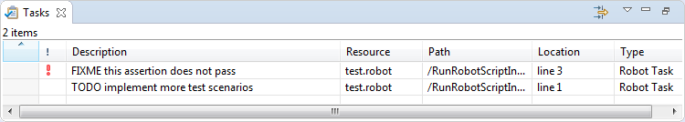

<html>
<head>
<link href="PLUGINS_ROOT/org.robotframework.ide.eclipse.main.plugin.doc.user/help/style.css" rel="stylesheet" type="text/css"/>
</head>
<body>
<a href="RED/../../../../help/index.html">RED - Robot Editor User Guide</a> &gt; <a href="RED/../../../../help/user_guide/user_guide.html">User guide</a> &gt; <a href="RED/../../../../help/user_guide/validation.html">Validation</a> &gt; 
<h2>Detecting tasks/TODO defined in comments</h2>

It is a common practice to put notes in comments describing some kind of tasks which needs to be done
in future. RED offers possibility to detect such tasks and overview them in single place. 

Tasks detection is done during validation phase, so the validation itself has to be enabled too. Once everything is
enabled RED will start reporting special kinds of markers similarly as Problems, but of different type (Task).
For example in following code there are two tasks defined in comments:

<code>
# TODO implement more test scenarios 
*** Test Cases *** 
case 
    &nbsp;&nbsp;&nbsp;&nbsp;Should Be Equal&nbsp;&nbsp;&nbsp;&nbsp;1&nbsp;&nbsp;&nbsp;&nbsp;2&nbsp;&nbsp;&nbsp;&nbsp;# FIXME this assertion does not pass 
    &nbsp;&nbsp;&nbsp;&nbsp;...
</code>
</body></html>

  

The detection is based on tags. When defined tag is found by RED inside the comment it will be reported as a__task__. By default there are two tags which RED recognizes: __TODO__ and __FIXME__: the firstone has normal priority while the latter is reported with high priority. The tags and their priorities can be specified in [preferences](#prefs).

  

Detected tasks are visible in RED in couple of places:

*   __Tasks__ view - this view is similar to Problems view and displays all the tasks reported for files in whole workspace (this view can be open from menu by choosing __`` Window -> Show View -> Other... -> General -> Tasks ``__), 
*   __Source__ tab of editor - icon is visible in line where task is defined on left vertical ruler as well as small square on right overview vertical ruler, 
*   __Tables__ tab of editor - icon is visible on element to which the task is attached on left ruler, 
*   __syntax coloring__ of comment - the detected tag is colored differently than the rest of the comment both  in source tab as well as tables 

<h3 id="prefs">Preferences</h3>

Following preferences can be changed regarding tasks detection:

*   __detection enablement__ - whole mechanism can be enabled or disabled at _<a class="command" href="javascript:executeCommand('org.eclipse.ui.window.preferences(preferencePageId=org.robotframework.ide.eclipse.main.plugin.preferences.tasks)')">
    Task Tags</a>_ page, 
*   __tags and their priorities__ - different tags can be specified at same  _<a class="command" href="javascript:executeCommand('org.eclipse.ui.window.preferences(preferencePageId=org.robotframework.ide.eclipse.main.plugin.preferences.tasks)')">
    Task Tags</a>_ page, 
*   __tags syntax coloring__ - the color of syntax highlighting for task tags can be specified at _<a class="command" href="javascript:executeCommand('org.eclipse.ui.window.preferences(preferencePageId=org.robotframework.ide.eclipse.main.plugin.preferences.editor.syntax)')">
    Syntax Coloring</a>_ page, 
*   __marker annotations__ color and appearance used by editor can be changed at _<a class="command" href="javascript:executeCommand('org.eclipse.ui.window.preferences(preferencePageId=org.eclipse.ui.editors.preferencePages.Annotations)')">
    Annotations</a>_ page. 