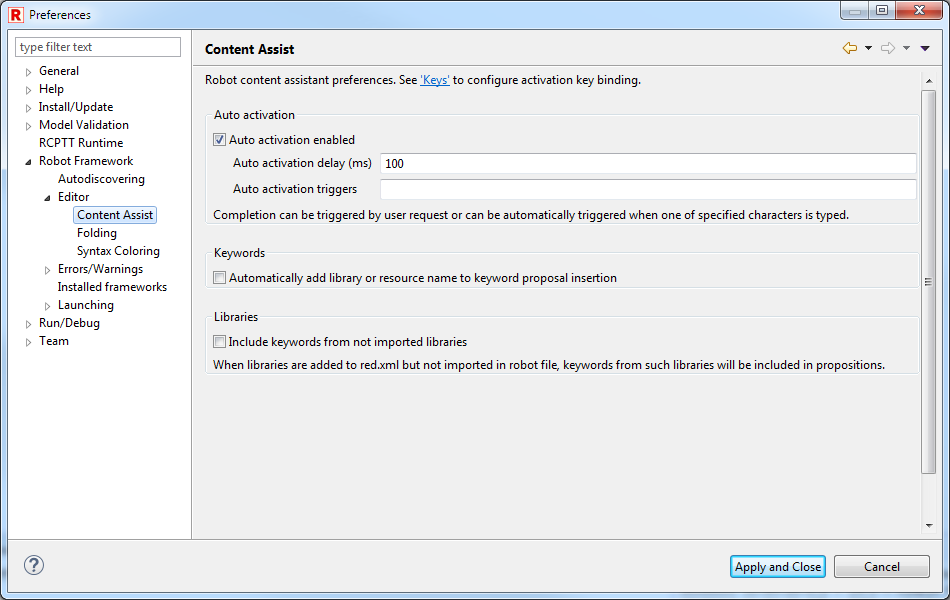

## Content assistance

Content assistance is a functionality provided by Eclipse platform extended to
understand Robot data model.  
By default it is invoked by pressing CTRL+SPACE key short-cut, but it can be
changed in binding keys preferences.  
It can be also invoked by typing one of auto activation characters defined in
preferences.  

### Content assistance mode of working

Assist window has multiple modes which are cycled by CTRL+SPACE. Next mode
type is displayed at the bottom of the window.  
  
  
  
  
All proposal containing given input are displayed. Proposals starting with
given input are displayed first.  
  
  
  
  
When given input is camel case string (for example: REA, CrBiFi, WaUCr)
keywords proposals that match that string are displayed before other matches.  
  
  
  
  

### Content assistance preferences

Behavior of content assist can be changed in Robot Framework preferences
(Window -> Preferences).  
Auto activation triggers and delay can be specified to automatically show
assist window when one of defined characters is typed.  
It can also be configured if library/resource prefix should be always used
when accepting content proposal.  
Keyword propositions from libraries available in red.xml but not imported in
robot file can be enabled too. Library import will be added automatically when
such proposal is accepted.  
  
  
  

[Return to Help index](http://nokia.github.io/RED/help/)
