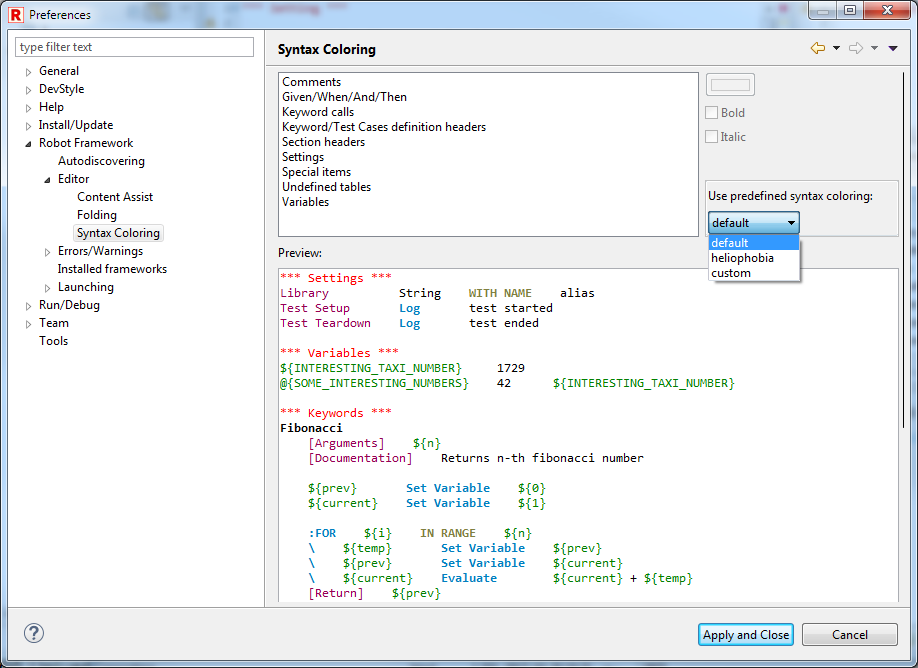
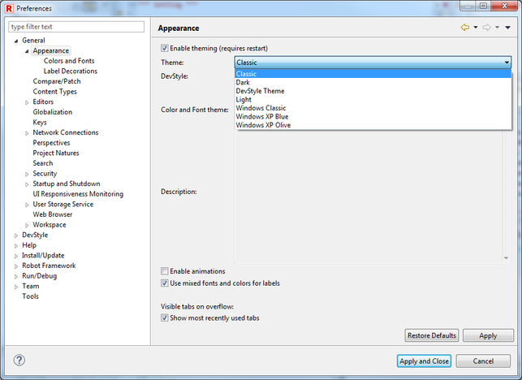
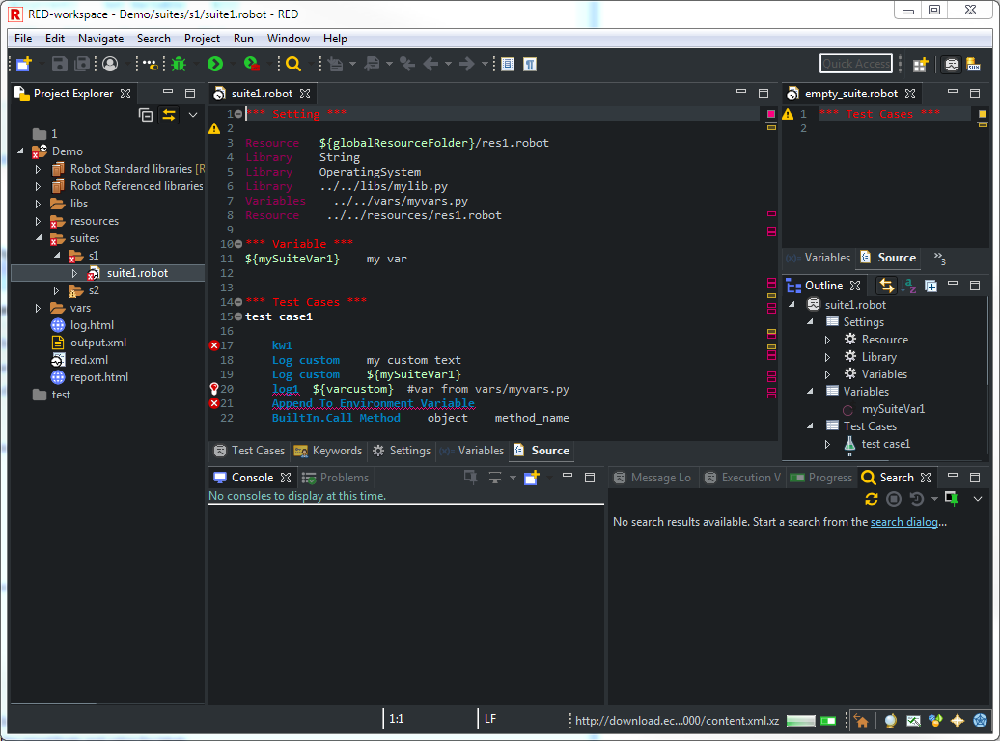

## Dark theme in RED

Dark theme is a popular way to reduce eyes strain especially in low-light
working environment reducing contrast between dark background and display.
From version 0.8.1 RED is compatible with Eclipse default dark theme.

### RED Syntax Coloring profiles

RED provides 2 default syntax coloring profiles used in RED source & tables
editors. Settings can be found at _[Window->Preferences->Robot
Framework->Editor>Syntax
Coloring](javascript:executeCommand\('org.eclipse.ui.window.preferences\(preferencePageId=org.robotframework.ide.eclipse.main.plugin.preferences.editor.syntax\)'\))_.

**Default** profile is used for light/default theme in Eclipse and it is the
same color palette as in older versions of RED. New **heliophobia** profile is
prepared to work with dark background. Any customization of colors are saved
into **custom** profile.  
Remember to reopen files after changing syntax coloring profiles.

Note

    The syntax coloring will automatically change to **heliophobia** profile once the theme is changed to dark. Some other colors stored in preferences are also adjusted - for example keyword occurrences annotation displayed in source editor.
  

### Changing to Dark theme

Dark theme can be changed in
_[Window->Preferences->Appearance](javascript:executeCommand\('org.eclipse.ui.window.preferences\(preferencePageId=org.eclipse.ui.preferencePages.Views\)'\))_
,

### Darkest Dark theme - expanded Dark theme for Eclipse

Darkest Dark plugin is the external theme which greatly improves Eclipse dark
theme making it consistent with modified icons and other UI elements for dark
profile.

Darkest Dark Theme can be installed from **Help -> Eclipse Marketplace** and
then be activated from
_[Window->Preferences->Appearance](javascript:executeCommand\('org.eclipse.ui.window.preferences\(preferencePageId=org.eclipse.ui.preferencePages.Views\)'\))_

[Return to Help index](http://nokia.github.io/RED/help/)
