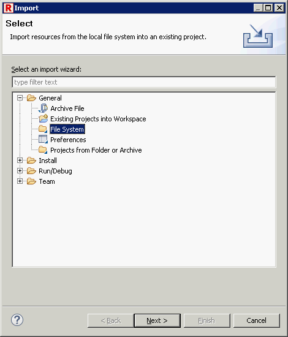

[RED - Robot Editor User Guide](http://nokia.github.io/RED/help/index.md) >
[User guide](http://nokia.github.io/RED/help/user_guide/user_guide.md) >
[Working with
RED](http://nokia.github.io/RED/help/user_guide/working_with_RED.md) >

## Different ways of importing files to project and workspace

Eclipse provides different ways of importing files to user workspace, some of
the possibilities can lead to problems with RED.  
Here are the possibilities how to include files to workspace from most
recommended to least:  

### 1\. Create project and import existing files

  
  
  
**Such import action will copy selected files to project folder under
workspace path.** Note that under Advanced options are unchecked.  
  
  
  

### 2\. Import existing project into workspace

  
  
  
**Selected project will be copied to workspace.**  
  
  
  

### 3\. Link project to workspace

  
  
  
Unchecked option will link project to workspace thus project will be stored in
existing place. Note that having project outside of workspace might cause
issues with paths to libraries and resources. Use this option with caution.  
  
  
  

### 4\. Link files to project

  
  
  
Linking files to project is the least recommended option.  
  
  
  

