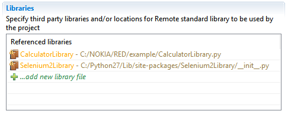
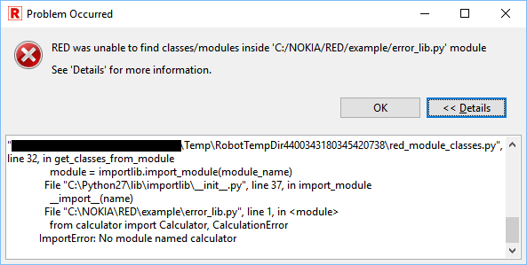

[RED - Robot Editor User Guide](http://nokia.github.io/RED/help/index.md) >
[User guide](http://nokia.github.io/RED/help/user_guide/user_guide.md) >
[Working with
RED](http://nokia.github.io/RED/help/user_guide/working_with_RED.md) >

## Recognizing external libraries in RED

Warning

    As of now RED is only able to recognize libraries for which _library specification_ file can be generated by `robot.libdoc` without arguments provided. This means that the library constructor cannot have required arguments (only default/varargs/kwargs). 

In order to provide validation and keyword assistance of external libraries
(any library not bundled with RobotFramework, but installed by pip or included
in testcase by file path), external library **needs** to be included in
**red.xml** file in the Referenced libraries part.

There are few ways to include library into red.xml.

### Library autodiscovery

Main mechanism to include libraries' keywords in RED is done by autodiscovery
mechanism. Mechanism works on two levels - during test edition and executed in
Project Explorer on group of files and folders.  
Every time when user edits test suite which has error markers on library
declaration, autodiscovery is executed together with save action.  
When there is a need to run autodiscovery on list of files, folders or whole
project, this can be achieved by using right click menu in Project Explorer
from Robot Framework option.

  
  

Note

    Library autodiscovering is not run on excluded project parts (see more under topic [Limiting validation scope](../validation/scope.md)). 

### Quick Fix - shortcut CTRL+1

Lets focus on following example:  
  
  
  
In sample testcase, there are two libraries included. CalculatorLibrary.py is
custom user local library placed in the same folder as testcase,
Selenium2Library was installed by pip.  
Both libraries are not recognized by RED as libraries names are underlined and
error markers are placed next to line numbers.  
Note the light bulb in error marker - it indicates that there is Quick Fix
action available.  
Click on the library name in test editor, open right click menu and choose
Quick Fix or use CTRL+1.  
  
  
  
After selecting Discover option, RED will search either PythonPath or library
file path, if successful library will be added to Referenced libraries in
red.xml  
  
  

### Add library from Project Explorer

External Python libraries can be directly included to red.xml file by right
clicking on file and using option:  
**`Robot Framework -> Add Library to red.xml.`**

### Add library from red.xml editor

External can be also added directly from red.xml editor:  
  
  
  

### Using libdoc file when external library is not present locally

In some scenarios, testware edit happens on different host than test runtime
thus it is undesirable/unnecessary to install/import all libraries as on
remote host. RobotFramework provides possibility to generate an xml file with
list of keywords, this also provides agile test development where libraries
are developed in parallel to test cases.  
Libdoc xml file can be included instead of external library file by using
red.xml editor.  
  
For more information about LibDoc please refer to <http://robot-
framework.readthedocs.io/en/latest/_modules/robot/libdoc.html?highlight=libdoc>  

### Library autodiscovering and libdoc generation preferences

Autodiscovering and libdoc generation preferences can be configured at `[
Window -> Preferences -> Robot Framework ->
Libraries](javascript:executeCommand\('org.eclipse.ui.window.preferences\(preferencePageId=org.robotframework.ide.eclipse.main.plugin.preferences.libraries\)'\))`

  
  

Warning

    If the libraries you are going to debug use `Gevent` library then please select **Support Gevent during autodiscovery** checkbox. This will make it possible for autodiscovery mechanism to support such libraries. Without this you may experience hanging both when looking for libraries as well as when keyword source is being searched. 

Note

    In some cases problems occur during libdoc generation via session server. It leads to a situation when the server hangs due to [Global Interpreter Lock](https://wiki.python.org/moin/GlobalInterpreterLock) between the server code and the library code.  
To avoid this problem since version 0.8.11 libdocs are generated in a separate
process by default. Note that this solution may affect the time of libdoc
generation, i.e. slowing down the libraries import, especially with jython
interpreter. If you are not using problematic libraries you can disable the
preference to make libdoc generation faster.

### Reloading libraries after change

Whenever external library is changed (for instance new keyword is added),
libdoc needs to be regenerated to provide changes on content assist and
validation in RED.  
Since version 0.6.3, RED can automatically detect library change and
regenerate libdoc (it can be switch off/on in
[preferences](javascript:executeCommand\('org.eclipse.ui.window.preferences\(preferencePageId=org.robotframework.ide.eclipse.main.plugin.preferences.libraries\)'\))).  
This can be also done manually by right clicking on library in Project
Explorer and selecting _Reload action_

Manual library reloading can be also useful for finding libdoc generation
errors.  
Whenever RED encounters libdoc generation problem, it will be shown as popup
window from Python execution:

  
  
This indicates that some of the dependencies are missing on your local machine
which may affect test suites execution. To verify you can try to execute
libdoc in console:  
_python -m robot.libdoc <PATH_TO_LIBNAME> list _

