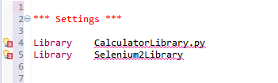
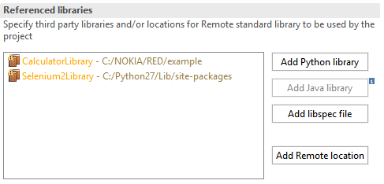

## Recognizing external libraries in RED

### External libraries installed by pip or included in testcase by file path

In order to provide validation and keyword assistance of external libraries
(any library not bundled with RobotFramework), external library **needs** to
be included in **red.xml** file in the Referenced libraries part.  
There are few ways to include library into red.xml

### Library autodiscovery

Main mechanism to include libraries' keywords in RED is done by autodiscovery
mechanism. Mechanism works on two levels - during test edition and executed in
Project Explorer on group of files and folders.  Every time when user edits
test suite which has error markers on library declaration, autodiscovery is
executed together with save action.  
When there is a need to run autodiscovery on list of files, folders or whole
project, this can be achieved by using right click menu in Project Explorer
from Robot Framework option.  
  
  
  

Autodiscovery mechanism is configured per project. Its preferences are stored
in red.xml file under Referenced Libraries tab.

Note

    Library autodiscovering is not run on excluded project parts (see more under topic [Limiting validation scope](../validation/scope.md). 

### Add library from Project Explorer

External libraries as python files can be directly included to red.xml file by
right clicking on file and using option:  
_Robot Framework -> Add Library to red.xml._

### Quick Fix - shortcut CTRL+1

Lets focus on following example:  
  
  
  
In sample testcase, there are two libraries included. CalculatorLibrary.py is
custom user local library placed in the same folder as testcase,
Selenium2Library was installed by pip.  
Both libraries are not recognized by RED as libraries names are underlined and
error markers are placed next to line numbers.  
Note the light bulb in error marker - it indicates that there is Quick Fix
action available.  
Click on the library name in test editor, open right click menu and choose
Quick Fix or use CTRL+1.  
  
  
  
Double click on Discover option, RED will search either PythonPath or library
file path, if successful library will be added to Referenced libraries in
red.xml  
  
  
  
  
All changes are stored in red.xml, if you need to modify them, open red.xml
using Eclipse Default Editor.

### Using libdoc file when external library is not present locally

In some scenarios, testware edit happens on different host than test runtime
thus it is undesirable/unnecessary to install/import all libraries as on
remote host. RobotFramework provides possibility to generate an xml file with
list of keywords, this also provides agile test development where libraries
are developed in parallel to test cases.  
Libdoc file can be included instead of link to external library by using
red.xml editor.  
  
For more information about LibDoc please refer to <http://robot-
framework.readthedocs.io/en/latest/_modules/robot/libdoc.html?highlight=libdoc>  

### Errors while importing Referenced Libraries

During library import, RED is generating LibDoc from given python file using
local python interpreter. Under the hood RED is executing following command to
RobotFramework to get list of Keywords from give library:  
_python -m robot.libdoc &ltPATH;_TO_LIBNAME> &ltOPTIONS;>_  
Whenever RED encounters problem, it will be shown as popup window from Python
execution:  
  
  
  
This indicates that some of the dependencies are missing on your local machine
which may affect testcase execution. To verify you can try to execute libdoc
in console:  
_python -m robot.libdoc &ltPATH;_TO_LIBNAME> list _

### Reloading libraries after change

Whenever external library is changed (for instance new keyword is added),
libdoc needs to be regenerated to provide changes on content assist and
validation in RED. Since version 0.6.3, RED can automatically detect library
change and regenerate libdoc (it can be switch off/on in red.xml).  
This can be also done manually by right clicking on library in Project
Explorer and selecting _Reload action_

[Return to Help index](http://nokia.github.io/RED/help/)
