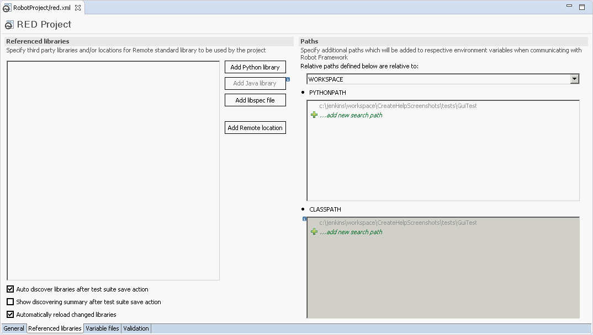

[RED - Robot Editor User Guide](http://nokia.github.io/RED/help/index.md) >
[User guide](http://nokia.github.io/RED/help/user_guide/user_guide.md) >
[Working with
RED](http://nokia.github.io/RED/help/user_guide/working_with_RED.md) >

# General information about red.xml

Red.xml is file which stores Project related settings, some of those controls
editing phase (validation, code assistance etc.), other can influence
RobotFramework execution.

It is always located in Project's root.

## Creating/recreating red.xml

Red.xml is automatically created when Robot project is created by action from
**`File -> New -> Robot Project`**.

In case of importing robot files to generic Eclipse project, right click on
Project in Project Explorer and select **`Robot Framework -> Add Robot
nature`** to create red.xml

  
  

In any case, red.xml shall be visible in Project Explorer in root folder.

## Red.xml parts

Red.xml can be viewed using default editor by double click on file. It will
load red.xml with graphical representation of file content. Alternatively, as
this is xml file, it can be viewed and edited by any text editor.

Red.xml is divided in 4 groups,with respectful tabs at the bottom of the
window: General, Libraries, Variables, Validation.

### General tab

This section allows to set python interpreter regardless of interpreter
setting in [Preferences](../launching/launch_prefs.md).

  
  

### Libraries tab

This section holds everything related to Robot external libraries.

**Libraries** \- holds a list of discovered or manually added libraries. It is
divided to **Referenced libraries** and **Remote locations**.

More info under topic [Recognizing external libraries in RED

**Paths** \- holds settings for user defined Python/ClassPath which are used
for Libraries discovery and testcase execution, additionally relative paths
relativity can be changed from Workspace to Project.

More info under topic [Custom python/class paths and path
relativeness](custom_paths_relatve.md)

  
  

### Variables tab

This section holds everything related to Robot variables.

**Variable mappings** \- values can be assigned to variables, this is used to
resolved parameterized paths.

More info under topic [Variable mapping - dealing with parameterized paths to
libraries and resources](variable_mapping.md)

**Variable files** \- this tab specify variable files which should be visible
on global scope. Those global variable files are used during testcase edit and
validation.

More info under topic [Variable Files - using files with variable accessible
anywhere inside Project](variable_files.md).

  
  

### Validation tab

This section allows user to limit validation to selected folder or exclude
selected folder from validation. To exclude folder in Project, right click on
folder and choose _Exclude_ from menu. Files can be also excluded by fixed
size [KB].

More info under topic [Limiting validation scope](../validation/scope.md).

  
  

