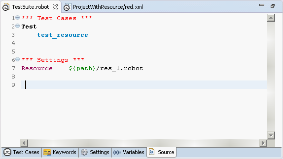

<html>
<head>
<link href="PLUGINS_ROOT/org.robotframework.ide.eclipse.main.plugin.doc.user/help/style.css" rel="stylesheet" type="text/css"/>
</head>
<body>
<a href="RED/../../../../help/index.html">RED - Robot Editor User Guide</a> &gt; <a href="RED/../../../../help/user_guide/user_guide.html">User guide</a> &gt; <a href="RED/../../../../help/user_guide/working_with_RED.html">Working with RED</a> &gt; 
<h2>Variable mapping - dealing with parameterized paths to libraries and resources</h2>

Whenever parameterized file path is used in resources or libraries paths (paths are resolved during Robot runtime when parameter in path is known), RED will not be able to evaluate parameter value by itself.
</body></html>

Variables mappings can be used to statically assign value to parameters in paths to resolve such paths to resources and libraries.

<dl class="note">
<dt>Note</dt>
<dd>Variables provided in red.xml are used only by RED for validation purpose and are not added to Robot run command line.</dd></dl>

    During test execution variables have to be provided by Robot.

Open __`` red.xml -> Variables ``__ and assign static value for path parameter in Variable mappings section:

  
When successful, path will be recognized and validation will take place.
 