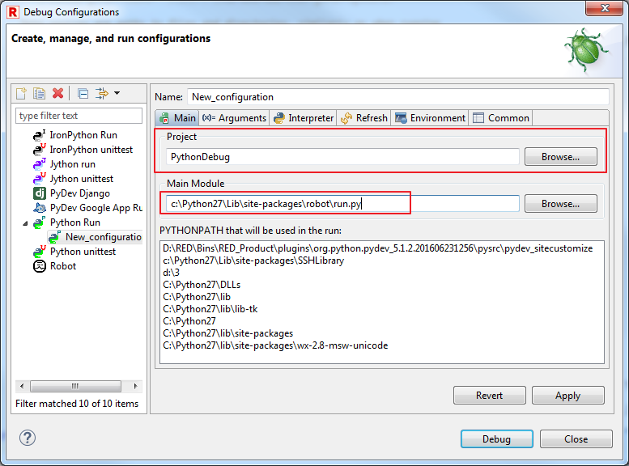
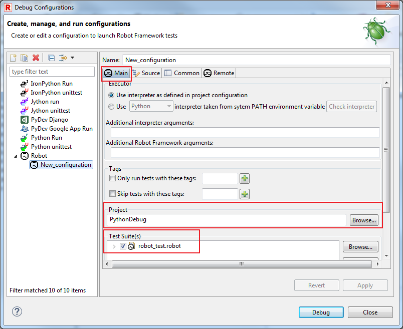

## Debug Robot&amp;Python; scripts

This article provides tutorial how to setup debugging of Python scripts while
running Robot testcases.  
For basic Robot testcase/keyword debugging, please refer to Debug topic in
Help.  

### Requirements

Installed PyDev with RED - Robot Editor.  
This is necessary to be able to run and debug Python scripts within Eclipse.  

### Debug Python scripts while running Robot testcase

In general, to allow debugging Python scripts while running Robot testcases,
you need to setup Python debug execution in such way that Python interpreter
will execute Robot runner with suite with enabled Python debugger.  
This will trigger any Python script's break point during Robot runtime.  
Instructions:  
  

  * Include project path in PYTHONPATH environment variable.
This can be done by editing variable on OS level or using PyDev Preferences:  
_Windows -&gt; Preferences -&gt; PyDev -&gt; Interpreters -&gt; Python_ under
_Libraries_  
  

  * Open Debug Configurations:
  
  

  * Edit or create new Python Run configuration:
  
  

  * Provide Project to be debugged, together with path to Robot runner run.py:
  
  

  * In Arguments tab, provide arguments passed to run.py for Robot execution.
This is the list of testcases/whole project to be included during Debug.  
  
  
If you are uncertain what should be included, try to run Robot testcase and
check console:  
  
  

  * Apply and Close/Debug.
Running such Debug configuration will start Python debugger.  
Remember to place at least one breakpoint inside Python script.

### Simultaneously debug Python scripts and Robot testcases

This is combination of running Python Debug with Remote Debug of Robot
testcases.  
In essence, there needs to be two RED/Eclipse instances - one instance is
running Python Debug with modification which allows to connect RED as Remote
Debug.  
This way in one instance (in this case it does not need to be Eclipse, any
Python env with proper debug&amp;Robot; remote arguments) Python debug can be
provided, remote RED instance is providing Robot debug functionalities.  
Using 2 Eclipse instances:  

#### Eclipse with Python Debug

  * Open Debug Configuration
  * Create or edit any of Robot Debug Configuration to export TestRunnerAgent.py script
TestRunnerAgent.py is a script to allow remote RED instance to connect to
running Robot.  

  * Edit Python Debug Configuration: in Arguments include remote listener
Remote listener allows to connect RED instance to running Robot execution
which will be provided on this Eclipse instance:  
_\--listener
&amp;ltPATH;_TO_TESTRUNNERAGENT.PY&gt;:&amp;ltLOCAL;_PORT&gt;:TRUE:&amp;ltLOCAL;_IP&gt;_  
**Note: arguments are position sensitive! Port number should be selected with care - for Windows Vista and above port should be in ranges 1024-5000 and 49152-65535**   
  

  * Apply&amp;Close;

#### RED/Eclipse with Robot Debug

  * Create/open different Workspace than in first Eclipse
  * Import Project for Debug
_Right click on Workspace -&gt; Import -&gt; General -&gt; Existing Projects
into Workspace_  
  
  

  * Edit Debug Configuration for Robot
In Main tab provide imported Project and testsuites:  
  
  

  * Configure Remote tab with LOCAL_IP and LOCAL_PORT from former Eclipse
  
  

#### Running Python&amp;Robot; debug

Start Robot Debug instance first than start Python Debug one.

