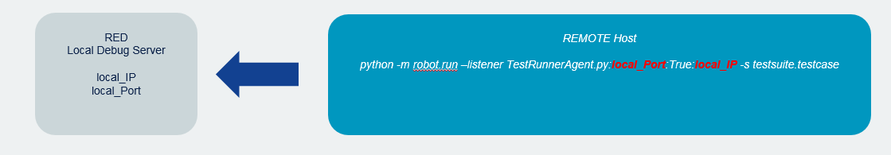
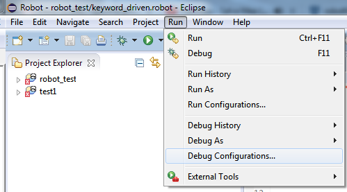

## Remote debug

Remote debug allows to perform debug activities with RED using remote host to
execute tests and get debug informaiton back to RED editor.  
It is especially useful when Robot tests are executed on dedicated test line
with hardware/software under test or in cloud environment where test editing
and test execution is separated.  
Remote debug is using custom RobotFramework listener (TestRunnerAgent.py
python script) which sends running test status to local RED Editor. Apart from
that, remote debug process does not differ from local debug - remember to set
at least one breakpoint prior the debug run.  
  
  
  

### Setting up Remote Debug

First choose testcase which will be remotely debugged. If there is no debug
configuration created for testcase, it's best to run local debug first even
though it may fail. This will create debug configuration which will be used in
later steps.  

### Getting TestRunnerAgent.py

  

  * Open Debug Configurations by Run -> Debug Configurations ...   
  
  
  

  * Go to testcase debug configuration under Robot tree, open tab Remote and click Export Debug Script to get TestRunnerAgent.py  
  
  
  
  

  * Copy TestRunnerAgent.py file to remote host. 

### Configure IP/port to accept connection from TestRunnerAgent.py

Remote tab of Debug Configurations consists Local IP and Local port. This
fields needs to be populated with local IP/port where RED is run.  
**Do not use _localhost_ in IP field as it is not supported.**  

### Running Remote Debug

After pressing Debug in Debug Configurations or starting Debug manually,
following Console entry should be visible:  
  
  
  
On remote host, testcase with custom listener (TestRunnerAgent.py) needs to be
started.  
Exact command depends on testing environment and testname, it can be derived
from local debug run and from RobotFramework robot.run implementation (see
<https://robot-framework.readthedocs.org/en/2.9/_modules/robot/run.html>).  
Generally syntax with additional listener is following:  
_python -m robot.run --listener REMOTE_PATH\TestRunnerAgent.py:PORT:True:IP
ADDITONAL_PARAMETERS_  
  
For instance: _python -m robot.run --listener
C:\RED\TestRunnerAgent.py:6060:True:192.168.81.1 -s robot_test.Keyword_driven_  
  

### Possible issues

When having problem with Remote Debug, please double check following:

* check if remote host can connect to local host (routing, firewalls) 
* check network settings in Debug Configurations (Port/IP) and in TestRunnerAgent command line parameters 
* check if you have the same test material locally and remotely (exact same testcases, test names) 

